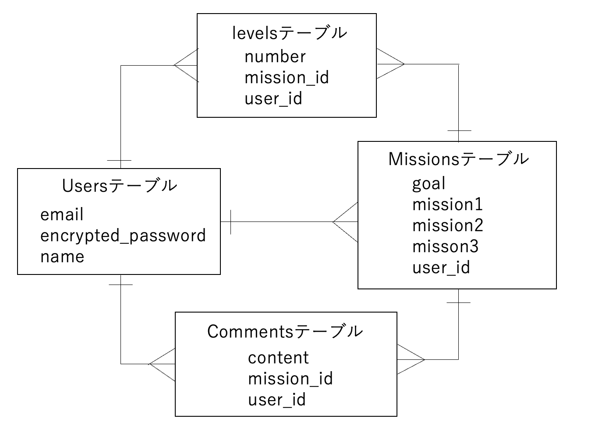
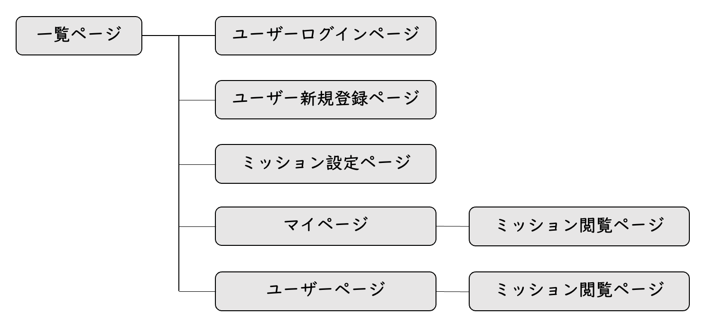

# アプリケーション名
  Mission Possible

# アプリケーション概要
  目標と、そこに到達するまでのステップを設定するアプリです。ユーザー同士でそれらを共有することもできます。

# URL
  https://missionpossible-rails7.onrender.com/

# テスト用アカウント
  ・Basic認証ID：admin
  ・Basic認証パスワード：122333
  ・メールアドレス：cherry@gmail.com
  ・パスワード：333221

# 利用方法
## 目標投稿・レベル上げ
  ・トップページ（一覧ページ）のヘッダーからユーザー新規登録を行います。
  ・ミッション設定ボタンから、ゴールと、３つのミッションを設定します。
  ・１つミッションを達成するごとに、「次のミッションへ進む」のボタンをクリックします。

## 応援メッセージ・アドバイス
  ・トップページ（一覧ページ）から、ユーザーの設定したゴールをクリックします。
  ・「応援メッセージ・アドバイス」の欄にコメントを入力し、「送信」をクリックします。
  
# アプリケーションを作成した背景
  これから主体的に学ぶことが求められる中、「何をどのように進めていけば良いか分からない」学習者が多いことが、課題として挙げられます。そこで目標へのステップを整理したり、他のユーザーと共有したりすることで、目標達成をサポートする場が必要と考え、作成に至りました。

# 実装した機能についての画像やGIFおよびその他の説明
  ・ユーザー登録機能：名前などを入力し、新しくユーザーを登録します。
    https://gyazo.com/f721d0528d1942b621b97a319e90883a
  ・ログイン・ログアウト機能：ログイン・ログアウト状態を作ります。ログアウト状態の間は、ミッションを編集できません。
    https://gyazo.com/ad690625cf04d38580bafefd44cc386d
  ・ミッションの設定機能：ゴールと３つのミッションを設定します。
    https://gyazo.com/e9b0d44141f4c21715abdc18de2671ed
  ・ミッションのレベル上げ機能：「次のミッションを進む」ボタンで、ミッションのレベルや画像が変化します。
    https://gyazo.com/4654c3e2c39784de5121c8a799668ebd
  ・コメント投稿機能：ユーザーが取り組んでいるミッションに対し、応援メッセージやアドバイスを投稿できます。
    https://gyazo.com/42bf5acc1defdf140283bfe83624f9b4
  ・ミッション削除機能：登録しているミッションを削除します。
    https://gyazo.com/9b2331a978b36a6346ecbb8e1592cdd5

# 実装予定の機能
  ・コメントの削除機能
  ・ミッションの編集機能

# データベース設計
  

# 画面遷移図
  

# 開発環境
  ・フロントエンド：HTML・CSS・JavaScript
  ・バックエンド：Ruby・Ruby on Rails
  ・インフラ：MySQL
  ・テスト：RSpec
  ・テキストエディタ：Visual Studio Code

# ローカルでの動作方法
  以下のコマンドを順に実行します。
  % git clone https://github.com/Taisei19
  % cd missionpossible
  % bundle install
  % yarn install
  
# 工夫したポイント
  目標へのステップを段階的に達成し、かつそれを楽しむことができるよう、「レベル上げ機能」を設定しています。レベルを上げると画像が切り替わり、他のユーザーにも共有されます。

# 改善点
  UXデザインに基づき、より目標達成に向けて計画できるように改善したいです。例えば、ミッションを編集したり、効果的なアドバイスが反映される機能が整えられればと思います。

# 制作時間
  およそ２週間です。

